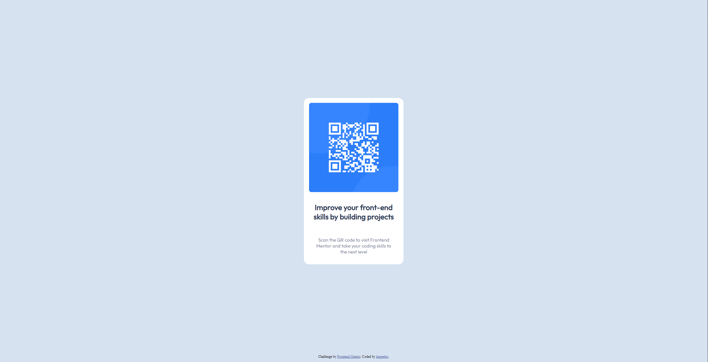

# Frontend Mentor - QR code component solution

This is a solution to the [QR code component challenge on Frontend Mentor](https://www.frontendmentor.io/challenges/qr-code-component-iux_sIO_H). Frontend Mentor challenges help you improve your coding skills by building realistic projects.

## Table of contents

- [Overview](#overview)
  - [Screenshot](#screenshot)
  - [Links](#links)
- [Author](#author)

## Overview

### Screenshot

### Links

- Solution URL: [https://github.com/kaggelos/qr-code-component](https://github.com/kaggelos/qr-code-component)
- Live Site URL: [https://kaggelos.github.io/qr-code-component/](https://kaggelos.github.io/qr-code-component/)

## Author

- GitHub - [Angelos Karampourniotis](https://www.github.com/kaggelos)
- Frontend Mentor - [@kaggelos](https://www.frontendmentor.io/profile/kaggelos)
